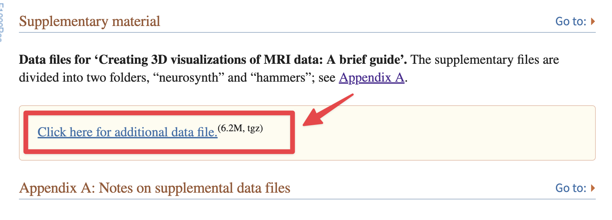
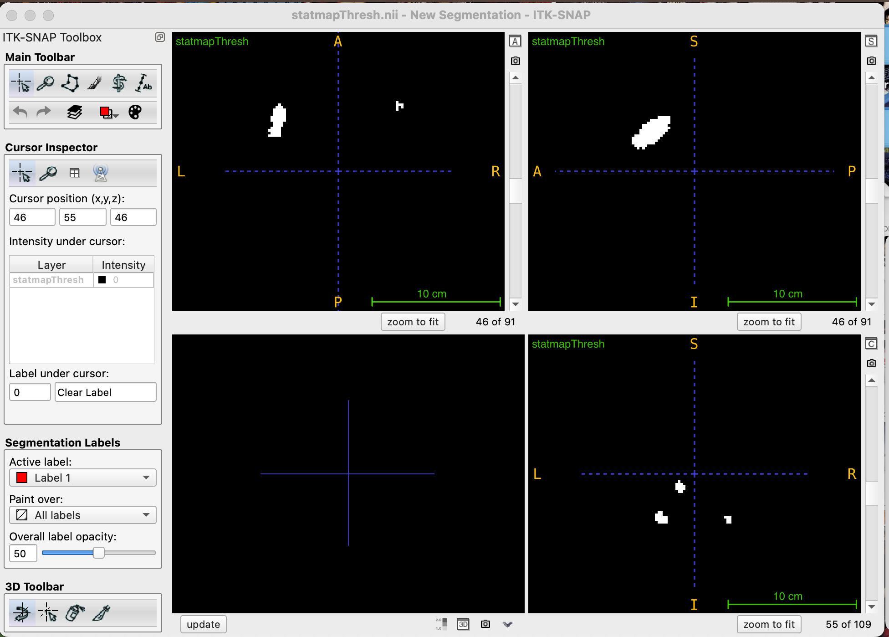
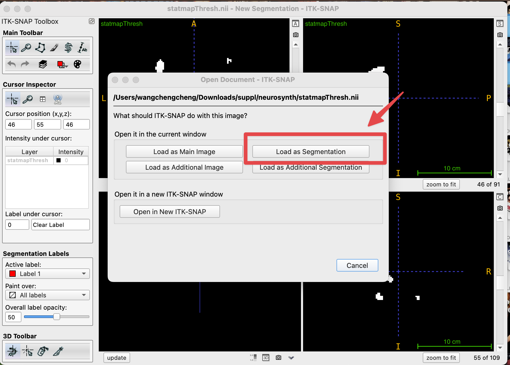
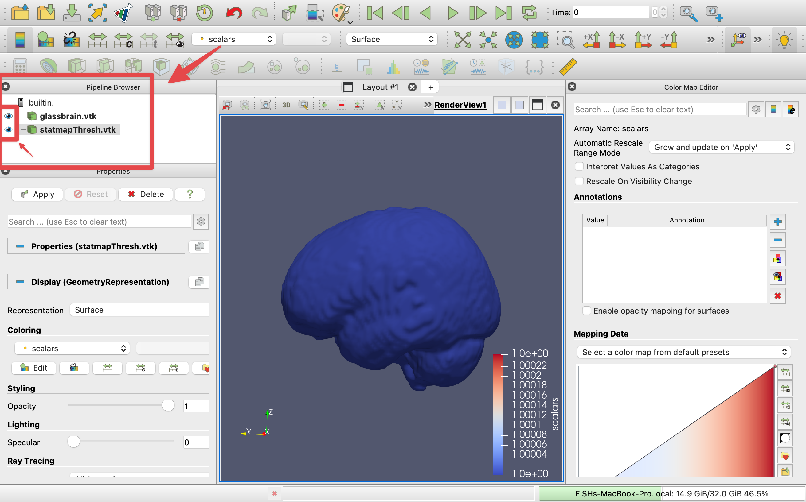
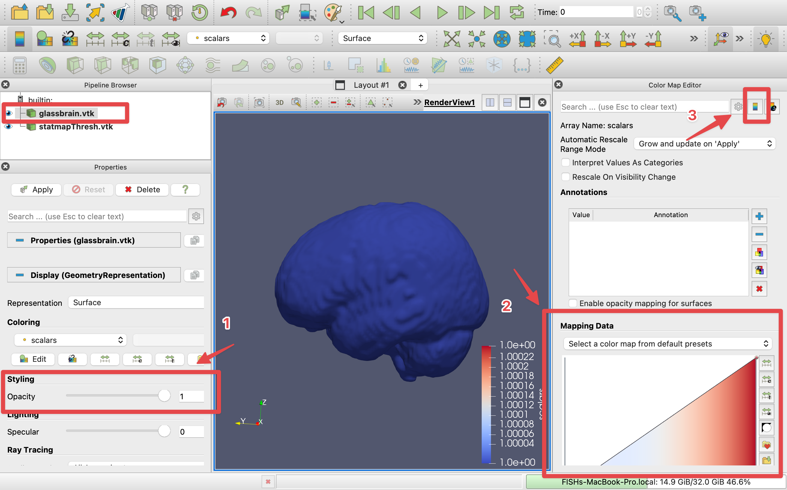
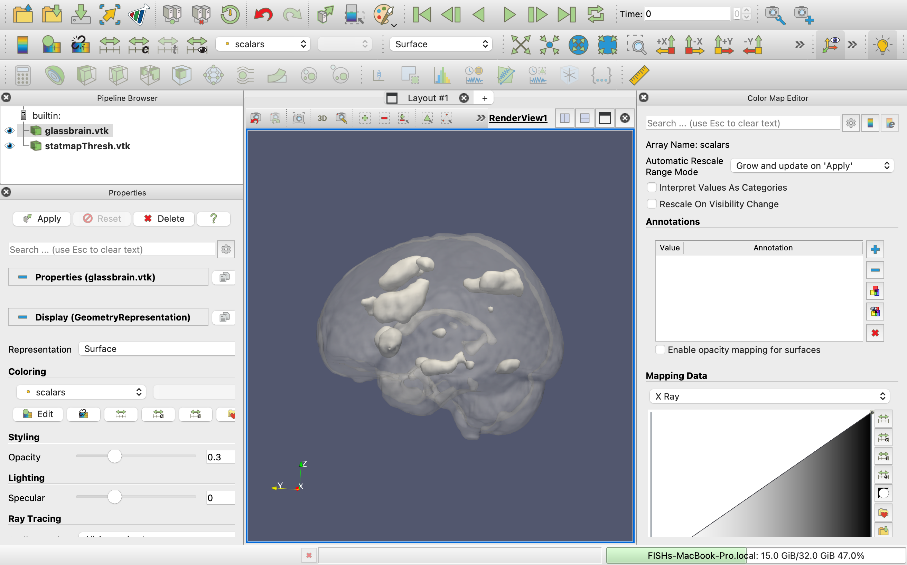
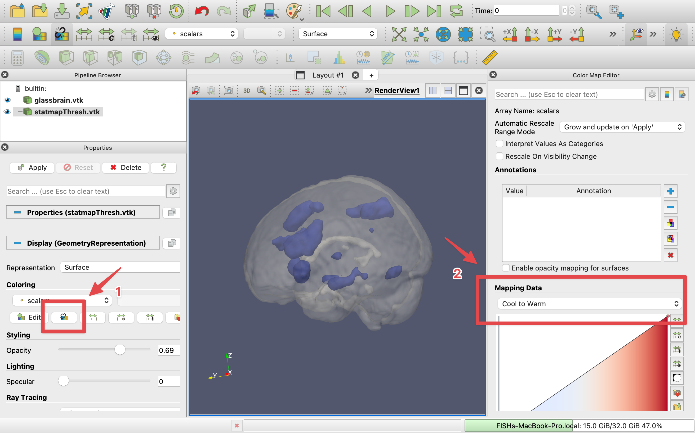
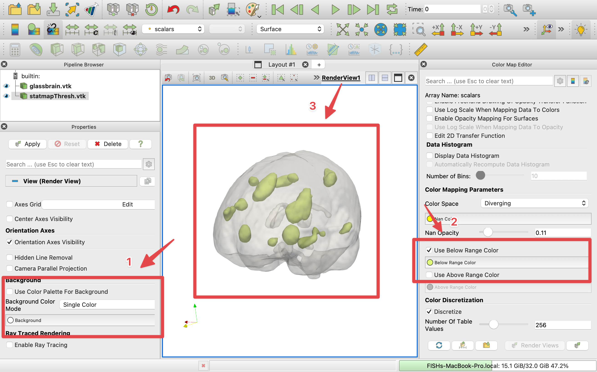

# 3D Brain Visualization Workflow
*by 🐟**chengchengfish***🐟
*posted on ✨February 1, 2024*✨

Welcome to this specialized repository, where 2D NIfTI brain imaging files are transformed into captivating 3D visualizations. This toolkit, ideal for neuroscientists, data analysts, and visualization enthusiasts, provides the necessary tools to convert brain scans into high-quality 3D models, ready for thorough analysis and dynamic presentations.

In navigating the realm of neuroimaging, I've gained invaluable insights into crafting exquisite 3D brain models by leveraging the teachings from Madan's paper and employing this toolkit's capabilities. What follows are the lessons I've learned along the way. For those seeking to delve deeper into these methodologies or to properly acknowledge the foundations of this work, I encourage you to consult Madan's original paper.👇

[Madan, C. R. (2015). Creating 3D visualizations of MRI data: A brief guide. F1000Research, 4, 466.](https://www.ncbi.nlm.nih.gov/pmc/articles/PMC4648228/)
&nbsp;

## Workflow steps
### Step 1: Prepare Your Imaging Files
You can start with your own pre-calculated statmap.nii files or experiment with the provided [Sample data](https://www.ncbi.nlm.nih.gov/pmc/articles/PMC4648228/).

1. Apply a height threshold to your **statmap.nii** file and perform clustering to produce an output file, e.g., **statmapThresh.nii**.

2. Apply the same height threshold to **anatomical.nii** without clustering, resulting in **glassbrain.nii**.
&nbsp;
---

### Step 2: Convert NIfTI to VTK Format with ITK-SNAP

1. Download and launch [**ITK-SNAP**](http://www.itksnap.org/pmwiki/pmwiki.php).

2. Main Image: Drag and drop **statmapThresh.nii** into the ITK-SNAP interface (it will automatically be set as the **main image** on the first import).
   
   
3. Segmentation Image: Drag and drop the **statmapThresh.nii** file into ITK-SNAP once more. This time, when prompted, choose the option to **Load as Segmentation**.
   
   
4. Save the file: Go to the **Segmentation** menu, choose **Export as surface mesh**, then **Export meshes for all labels as a single scene**. This step converts segmented images into a **VTK** format, **statmapThresh.vtk**

5. Repeating for Glassbrain: Follow similar steps for the **glassbrain.nii** file to convert to **glassbrain.vtk**.
&nbsp; 
---
### Step 3: 3D Visualization in ParaView
Visualize and interact with 3D brain structures using ParaView.

1. Download and launch [ParaView](https://www.paraview.org/download/)

2. Import VTK Files: Load both **statmapThresh.vtk** and **glassbrain.vtk** into ParaView.
    

3. Tailor the visualization to your preferences by altering opacity, color maps, and other display settings.
    1. Select **glassbrain.vtk** under the builtin section to begin customization.
        1. Adjust the **opacity** slider on the left panel to set the glassbrain to semi-transparent, enhancing depth perception in the visualization.
        2. Change the **color map** on the right panel to select a preferred color scheme that enhances the visualization's clarity and contrast.
        3. Opt to hide the **color legend** for a cleaner view, focusing solely on the brain structure.
            
            

    2. Choose **statmapThresh.vtk** under the builtin category to apply different visualization settings from the glassbrain.         
        1. Select **Use separate color map** on the left to differentiate statmap's coloration from the glassbrain, enhancing the distinction between different brain regions or activity levels.
        2. Modify the **color map** on the right to apply a unique color palette that highlights the statmap data effectively.
            
           

    3. Personalize Colors and Background. 
        1. Uncheck **Use color palette for background** on the left and select **Background** to choose a custom color that complements or contrasts with your data for better visual distinction.
        2. On the right, select **Use below range color** and pick a specific color for brain regions from the **Below Range Color** option, aiding in data interpretation.
            
&nbsp;
___

## Customization and Extensions

The given workflow is fully customizable, allowing users to adjust colors, angles, and transparency levels to best suit the data's story. The provided Adobe Illustrator steps further enhance the final visuals for a sleek, professional look which I will upload later.
&nbsp;

